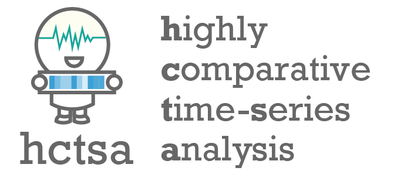

# :wavy_dash: _hctsa_ :wavy_dash:: highly comparative time-series analysis

 	
 	
    
    

_hctsa_ is a Matlab software package for running highly comparative time-series analysis.
It extracts thousands of time-series features from a collection of univariate time series and includes a range of tools for visualizing and analyzing the resulting time-series feature matrix, including:

1. Normalizing and clustering time-series data;
2. Producing low-dimensional representations of time-series data;
3. Identifying and interpreting discriminating features between different classes of time series; and
4. Fitting and evaluating multivariate classification models.

__Feel free to [email me](mailto:ben.d.fulcher@gmail.com) for advice on applications__ of _hctsa_ :nerd_face:

## Installation :arrow_down:

For users _familiar with git_ (recommended), please [make a fork](https://help.github.com/articles/fork-a-repo/) of the repo and then clone it to your local machine.
To update, after setting an upstream remote (`git remote add upstream git://github.com/benfulcher/hctsa.git`) you can use `git pull upstream main`.
To obtain the latest toolboxes (like the optimized _catch22_ faeture set) you should then run `git submodule update --init`.

Users _unfamiliar with git_ can instead download the repository by clicking the green "Code" button then "Download ZIP".

Once downloaded, you can install _hctsa_ by running the `install.m` script (see [docs](https://hctsa-users.gitbook.io/hctsa-manual) for details).

<!-- We recommend working outside of the repository so that incremental updates can be pulled from the upstream repository. -->

## Documentation and Wiki &#x1F4D6;

__Comprehensive documentation__ for _hctsa_, from getting started through to more advanced analyses is on [GitBook](https://hctsa-users.gitbook.io/hctsa-manual).

There is also alot of additional information on the [__wiki__](https://github.com/benfulcher/hctsa/wiki/), including:

- :point_right: Information about alternative feature sets (including the much faster [catch22](https://github.com/DynamicsAndNeuralSystems/catch22)), and information about other time-series packages available in R, python, and Julia.
- :wavy_dash: The accompanying time-series data archive for this project, [_CompEngine_](http://www.comp-engine.org).
- :floppy_disk: Downloadable _hctsa_ feature matrices from time-series datasets with example workflows.
- :computer: Resources for [distributing an _hctsa_ computation](https://github.com/benfulcher/distributed_hctsa) on a computing cluster.
- :closed_book: A [list of publications](https://github.com/benfulcher/hctsa/wiki/Publications-using-hctsa) that have used _hctsa_ to address different research questions.
- :information_desk_person: Frequently asked questions about _hctsa_ and related feature-based time-series analyses.

## Acknowledgement :+1:

If you use this software, please read and cite these open-access articles:

- &#x1F4D7; B.D. Fulcher and N.S. Jones. [_hctsa_: A computational framework for automated time-series phenotyping using massive feature extraction](http://www.cell.com/cell-systems/fulltext/S2405-4712\(17\)30438-6). _Cell Systems_: __5__, 527 (2017).
- &#x1F4D7; B.D. Fulcher, M.A. Little, N.S. Jones. [Highly comparative time-series analysis: the empirical structure of time series and their methods](http://rsif.royalsocietypublishing.org/content/10/83/20130048.full). _J. Roy. Soc. Interface_: __10__, 83 (2013).

Feedback, as [email](mailto:ben.d.fulcher@gmail.com), [GitHub issues](https://github.com/benfulcher/hctsa/issues) or [pull requests](https://help.github.com/articles/using-pull-requests/), is much appreciated.

__For commercial use of _hctsa_, including licensing and consulting, contact [Engine Analytics](http://www.engineanalytics.org/).__

## Licenses

### Internal licenses

There are two licenses applied to the core parts of the repository:

1. The framework for running _hctsa_ analyses and visualizations is licensed as the [Creative Commons Attribution-NonCommercial-ShareAlike 4.0 International License](http://creativecommons.org/licenses/by-nc-sa/4.0/).
A license for commercial use is available from [Engine Analytics](http://www.engineanalytics.org/).

2. Code for computing features from time-series data is licensed as [GNU General Public License version 3](http://www.gnu.org/licenses/gpl-3.0.en.html).

A range of external code packages are provided in the `Toolboxes` directory of the repository, and each have their own associated license (as outlined below).

### External packages and dependencies

Many features in _hctsa_ rely on external packages and Matlab toolboxes.
In the case that some of them are unavailable, _hctsa_ can still be used, but only a reduced set of time-series features will be computed.

_hctsa_ uses the following [Matlab Add-On Toolboxes](https://au.mathworks.com/products.html): Statistics and Machine Learning, Signal Processing, Curve Fitting, System Identification, Wavelet, and Econometrics.

The following external time-series analysis code packages are provided with the software (in the `Toolboxes` directory), and are used by our main feature-extraction algorithms to compute meaningful structural features from time series:

- [_TISEAN_ package for nonlinear time-series analysis, version 3.0.1](http://www.mpipks-dresden.mpg.de/~tisean/Tisean_3.0.1/index.html) (GPL license).
- [_TSTOOL_ package for nonlinear time-series analysis, version 1.2](http://www.dpi.physik.uni-goettingen.de/tstool/) (GPL license).
- Joseph T. Lizier's [Java Information Dynamics Toolkit (JIDT)](https://github.com/jlizier/jidt) for studying information-theoretic measures of computation in complex systems, version 1.3 (GPL license).
- Time-series analysis code developed by [Michael Small](http://staffhome.ecm.uwa.edu.au/~00027830/code.html) (unlicensed).
- Max Little's [Time-series analysis code](http://www.maxlittle.net/software/index.php) (GPL license).
- Sample Entropy code from [Physionet](https://archive.physionet.org/faq.shtml#license) (GPL license).
- [_ARFIT_ Toolbox for AR model estimation](http://climate-dynamics.org/software/#arfit) (unlicensed).
- [_gpml_ Toolbox for Gaussian Process regression model estimation, version 3.5](http://www.gaussianprocess.org/gpml/code/matlab/doc/) (FreeBSD license).
- Danilo P. Mandic's [delay vector variance code](http://www.commsp.ee.ic.ac.uk/~mandic/dvv.htm) (GPL license).
- [Cross Recurrence Plot Toolbox](http://tocsy.pik-potsdam.de/CRPtoolbox/) (GPL license)
- Zoubin Ghahramani's [Hidden Markov Model (HMM) code](http://mlg.eng.cam.ac.uk/zoubin/software.html) (MIT license).
- Danny Kaplan's Code for embedding statistics (GPL license).
- Two-dimensional histogram code from Matlab Central (BSD license).
- Various histogram and entropy code by Rudy Moddemeijer (unlicensed).

## Acknowledgements :wave:

Many thanks go to [Romesh Abeysuriya](https://github.com/RomeshA) for helping with the mySQL database set-up and install scripts, and [Santi Villalba](https://github.com/sdvillal) for lots of helpful feedback and advice on the software.
